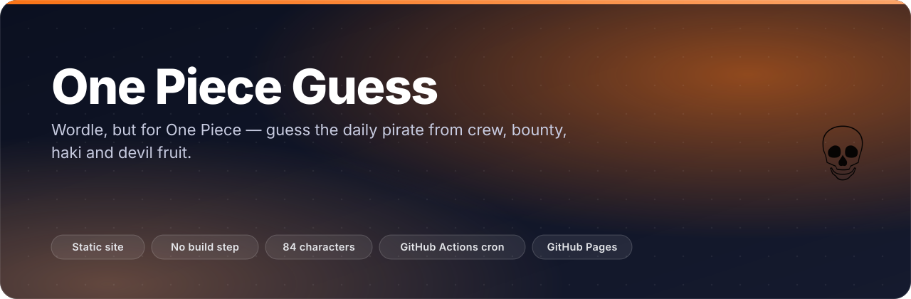
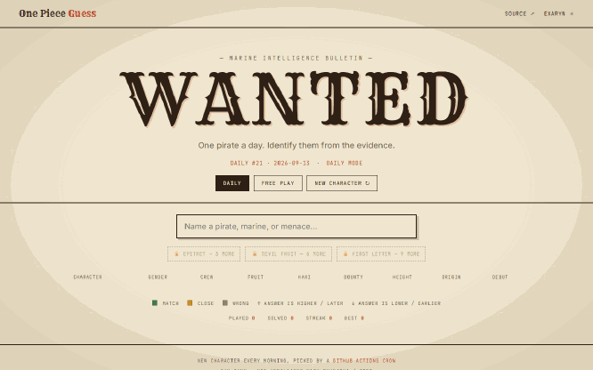
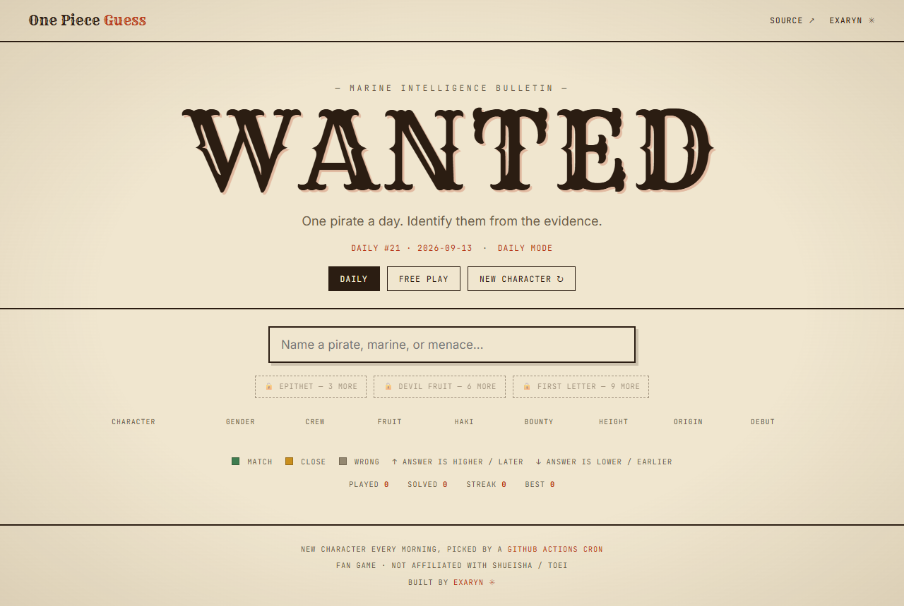
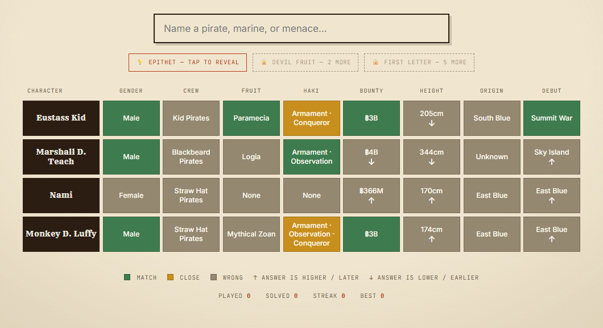
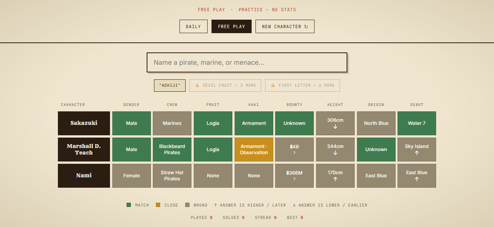
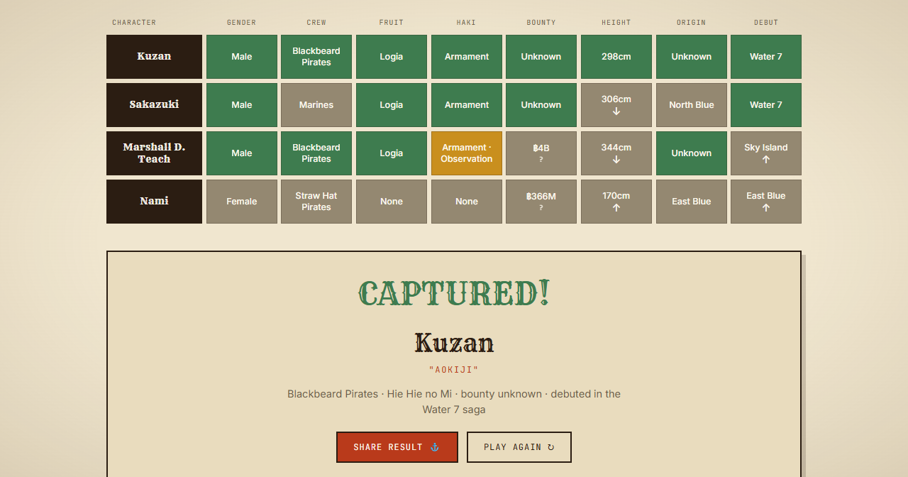
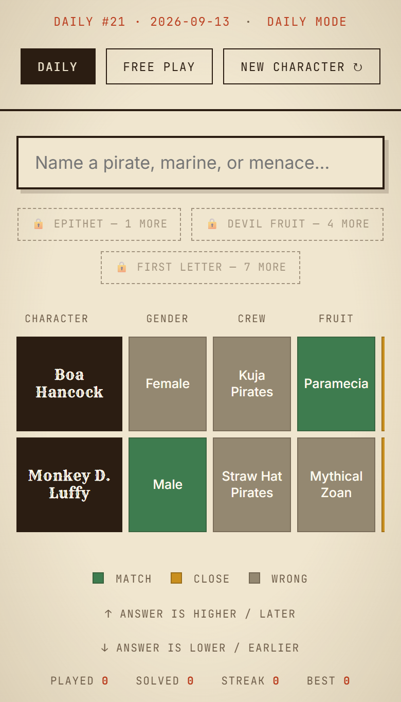
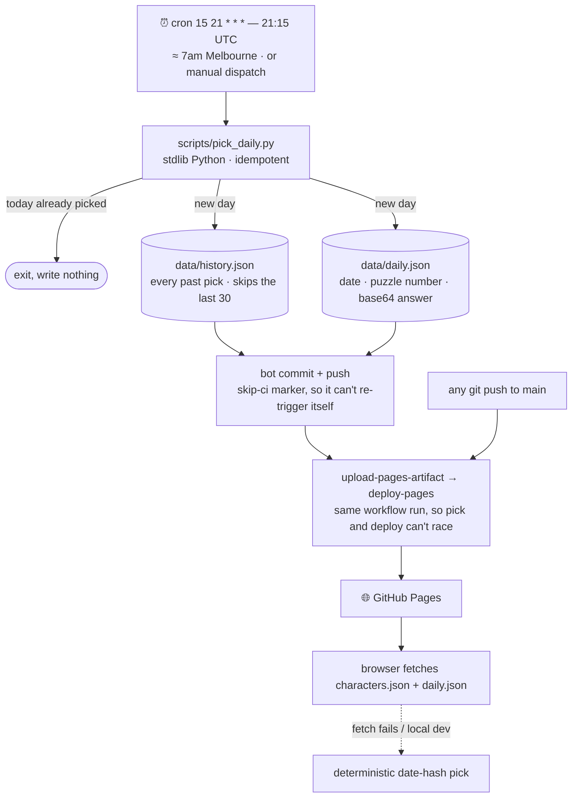
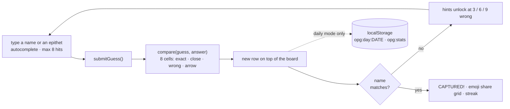

<p align="center"></p>

<p align="center">
  <b>Wordle, but for One Piece. One pirate a day, chosen by a cron job at 21:15 UTC — breakfast in Melbourne —
  and every wrong guess tells you how close you are on crew, bounty, haki, devil fruit and five more columns.</b>
</p>

<p align="center">
  <a href="https://chinmaygit8765.github.io/one-piece-guess-game/"></a>
  
  
  
  
</p>

## ✨ What it does

- **A new character every morning**, chosen by a GitHub Actions cron that commits its pick back into the repo — no server, no database, just `data/daily.json` and git history.
- **Eight clue columns per guess** — gender, crew, devil fruit type, haki, bounty, height, origin, debut saga — with 🟩 match / 🟨 close / ⬛ wrong tiles and ↑ ↓ arrows telling you whether the answer's bounty, height and debut sit higher or lower.
- **Unlimited guesses, escalating help.** Three hints unlock after 3 / 6 / 9 wrong guesses: epithet, devil fruit, first letter. The round only ends when you name them.
- **Free Play mode** deals unlimited random characters (never today's answer, so it can't spoil the daily) and never touches your stats.
- **Streaks and share grids** — a Wordle-style emoji grid on the clipboard, played/solved/streak/best kept in `localStorage`. No accounts, no tracking.
- **84 hand-curated characters** in one flat JSON file, an autocomplete that searches names *and* epithets, and a `?embed=1` chromeless mode for iframing the game into another page.

## 🎬 See it

<p align="center"></p>
<p align="center"><sub>Four real guesses against the live site — type a name (or an epithet: "blackbeard" finds Marshall D. Teach), hit Enter, watch the row light up. After three misses the epithet hint flips from 🔒 to 💡.</sub></p>

<table><tr>
<td width="50%"><br><sub><b>Cold start.</b> Daily #21 · 2026-09-13, a locked hint row and an empty board.</sub></td>
<td width="50%"><br><sub><b>Four guesses in.</b> Eustass Kid shares the answer's fruit type, bounty and debut saga; the ↓ says the answer is shorter than 205&nbsp;cm.</sub></td>
</tr><tr>
<td width="50%"><br><sub><b>Free play.</b> "PRACTICE — NO STATS" — a revealed epithet hint and a board that leaves your streak alone.</sub></td>
<td width="50%"><br><sub><b>Captured.</b> A full green row, the answer's epithet and facts, and a one-tap share grid.</sub></td>
</tr></table>

<p align="center"><br><sub>On a phone the clue board scrolls sideways and the hint row wraps — same game, no separate build.</sub></p>

## 🧠 How it works

The daily answer is not computed in the browser and not stored in a database. A cron job picks it, commits it, and the same workflow run deploys the site, so the pick and the deploy can never race each other.



**In the browser** it is one 457-line script with no framework. Every guess runs `compare(guess, answer)` over the eight columns, prepends a row to the board (newest on top), and re-checks the hint thresholds:



| tile | what it means |
|---|---|
| 🟩 **MATCH** | the guess and the answer have exactly the same value |
| 🟨 **CLOSE** | *some* haki in common, or both devil fruits are in the Zoan family |
| ⬛ **WRONG** | nothing in common (or an unknown bounty facing a known one) |
| ↑ / ↓ | the answer's bounty / height / debut saga is higher-later / lower-earlier |

Debut arrows walk an ordered list of eleven sagas, East Blue → Egghead, so "later" means later in the story. Daily progress is keyed by date (`opg:day:2026-09-13`), so reloading mid-puzzle restores your board, and solving it starts a live countdown to 21:15 UTC — the moment the cron fires again. Free play is deliberately excluded from both the save and the stats.

## ⏰ Build your own daily-anything game

**This repo doubles as the guide.** The Wordle-clone-with-a-cron pattern is three moving parts and none of them need a backend. Steal them.

### 1. A picker script that is *idempotent*

[`scripts/pick_daily.py`](scripts/pick_daily.py) is ~60 lines of stdlib Python:

1. Compute "today" in **your** timezone (`zoneinfo`, with a fixed-offset fallback for machines without tzdata). The day should tick over when your players wake up, not at UTC midnight.
2. If `history.json` already has a pick for today, **exit without writing anything.** This is the important bit — it makes re-runs, manual dispatches and workflow retries completely safe.
3. Otherwise pick randomly, **excluding the last 30 picks** so the daily doesn't repeat, append to `history.json`, and write `daily.json` with the date, a running puzzle number, and the answer base64-encoded so it isn't sitting in plaintext in the network tab. Anyone determined can decode it — Wordle rules: cheaters only cheat themselves.

### 2. A workflow that picks, commits, and deploys

[`.github/workflows/daily.yml`](.github/workflows/daily.yml) runs on three triggers:

```yaml
on:
  push:                       # deploy on every push
    branches: [main]
  schedule:
    - cron: "15 21 * * *"     # daily — 21:15 UTC ≈ 7am Melbourne
  workflow_dispatch:          # manual "run it now" button
```

On cron and manual runs it executes the picker, then commits the result back:

```yaml
# Cron / manual runs pick a new character; plain pushes deploy as-is.
- name: Pick character of the day
  if: github.event_name != 'push'
  run: python3 scripts/pick_daily.py

- name: Commit today's pick
  if: github.event_name != 'push'
  run: |
    git config user.name "one-piece-guess-bot"
    git config user.email "actions@users.noreply.github.com"
    git add data/
    if git diff --cached --quiet; then
      echo "pick unchanged, nothing to commit"
    else
      git commit -m "daily: new character [skip ci]"
      git push
    fi
```

<details><summary><b>Gotchas that each cost an afternoon</b></summary>

- `permissions: contents: write` is required or the push is rejected.
- `[skip ci]` in the commit message is what stops the bot's own push from re-triggering the workflow in an infinite loop.
- The same job then deploys to Pages (`upload-pages-artifact` + `deploy-pages`), so the pick and the deploy can never race each other. A `concurrency: group: pages` guard keeps overlapping runs from fighting.
- GitHub cron is best-effort — it can fire minutes late. Design for "roughly morning", not "exactly 7:00:00".
- Scheduled workflows get **disabled after 60 days of repo inactivity**. The daily commit from the bot conveniently counts as activity, so this setup keeps itself alive.

</details>

### 3. A client that trusts the JSON but has a fallback

The page fetches `data/daily.json` and plays whatever it says. If that fetch fails — local file dev, or the cron has never run — it falls back to a deterministic hash of today's date, so everyone still gets the same character and the game never breaks. The cron just makes it *better*: true randomness, no-repeat memory, a stable puzzle number.

### Ship it

1. Fork or clone, push to `main` on a new GitHub repo.
2. Repo **Settings → Pages → Source: GitHub Actions**.
3. Done. Every push deploys; every morning the cron picks, commits, deploys.

To reskin it for another fandom: replace [`data/characters.json`](data/characters.json) with your own roster, adjust the columns in `compare()` in [`assets/game.js`](assets/game.js), and change the cron time to your timezone. Everything else carries over untouched.

## 🚀 Quick start

```sh
git clone https://github.com/ChinmayGit8765/one-piece-guess-game
cd one-piece-guess-game

npm run dev          # npx serve -l 3000 .  →  http://localhost:3000
# or, with no node at all:
python -m http.server 3000

npm run pick         # = python scripts/pick_daily.py — force a new daily pick
```

`fetch()` needs http, so opening `index.html` straight from disk won't load the data. Nothing to build and nothing in `node_modules` — `npx` fetches a static file server on demand, and `python -m http.server` needs nothing at all. The repo *is* the deploy artifact.

## 🗂️ Project layout

```
index.html                the whole game page (88 lines)
assets/style.css          wanted-poster design — parchment, ink, bounty red
assets/game.js            engine: compare logic, autocomplete, hints, share grid, stats
data/characters.json      the roster (84 characters) — add your own!
data/daily.json           today's pick — written by the cron, don't edit by hand
data/history.json         every past pick — keeps the cron from repeating itself
scripts/pick_daily.py     the picker (stdlib-only Python)
.github/workflows/        daily cron + GitHub Pages deploy, one job
```

## 🧰 Stack

| layer | choice | why |
|---|---|---|
| markup & logic | hand-written HTML + vanilla JS (no framework) | no build step means the repo is the deploy artifact |
| styling | one CSS file with custom properties | a wanted-poster look, nothing to fight |
| type | Rye + Inter + JetBrains Mono via Google Fonts | display serif for the poster, mono for the bulletin voice |
| data | two JSON files (roster + today's pick) | reskin the whole game by swapping a file |
| daily pick | Python 3, standard library only | runs on the Actions runner with zero install |
| automation | GitHub Actions cron + commit-back | the repo is the database; git log is the archive |
| hosting | GitHub Pages, same workflow run | pick and deploy in one job, so they can't race |
| state | `localStorage` | streaks without accounts or a backend |

## 🗺️ Status

- ✅ **Live and running daily** — first pick 2026-08-24, puzzle #21 on 2026-09-13, one bot commit per day since.
- ✅ Daily mode, free play, three-tier hints, share grid, streak stats, restored progress, mobile board.
- ✅ Zero dependencies, zero build, zero backend; `?embed=1` renders the game chromeless for iframes.
- 🚧 **Data is fan-curated and lightly simplified** — unconfirmed haki is omitted and sub-arcs are grouped into their saga, so a few cells are judgement calls.
- 🔜 Roster growth and corrections are the roadmap: the schema is one flat object per character, so a fix is a one-line diff.

## 🤝 Contributing

Spot a wrong bounty, a missing haki, a character who should obviously be in here? Edit [`data/characters.json`](data/characters.json) and open a PR — one flat object per character, no build to run, no tests to break.

Fan project. Not affiliated with Eiichiro Oda, Shueisha, or Toei Animation. The cron pattern in the guide above is yours to copy; there is no licence file in the repo yet, so if you want to reuse the code wholesale, open an issue and one will land.

<p align="center"><sub>Built by <a href="https://github.com/ChinmayGit8765">Chinmay</a> · part of the <a href="https://chinmaygit8765.github.io/exaryn-studio/">Exaryn</a> studio</sub></p>
